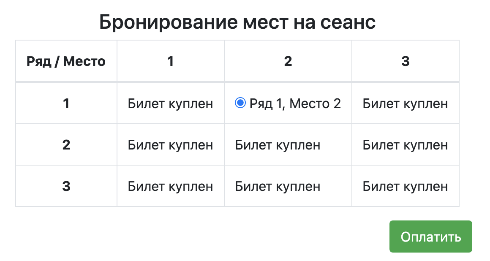
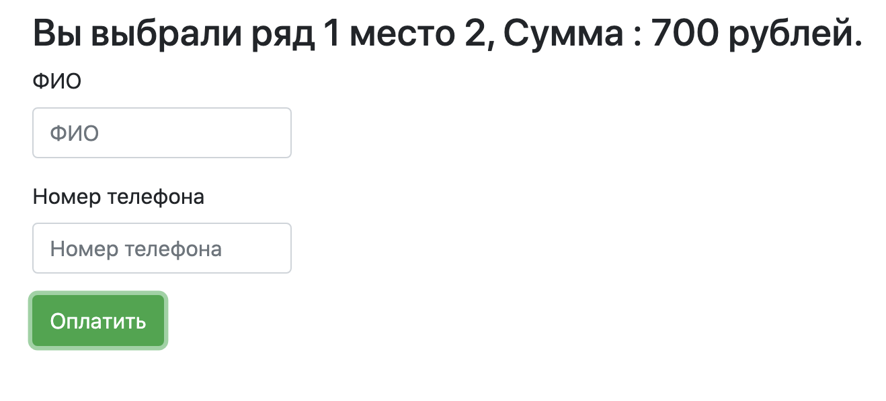
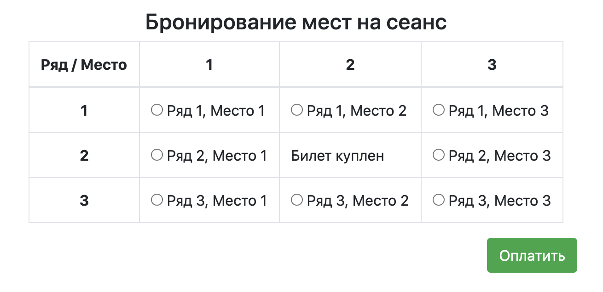

# Кинотеатр - сервис по покупке билетов
Простое веб-приложение по бронированию билетов в кинотеатр. 
Стартовая страница index.html

После выбора места пользователь перенаправляется на отдельную страницу для
 ввода имени и телефона
 
 
 
 После нажатия на кнопку "Оплатить" приложение возвращается на начальный экран,
 где путем периодического опроса БД проверяются занятые места, и если место занято 
 (билет куплен другим пользователем), то высвечивается надпись "Билет куплен", и 
 имеется возможность выбрать только свободное место.
 
 
 При разработке приложения использованы технологии:
 * HTML, JS, JQuery
 * Java 14
 * Apache Maven
 * Apache Tomcat 9
 * Servlet Api
 * Ajax
 * PostgreSQL
 

 
 

